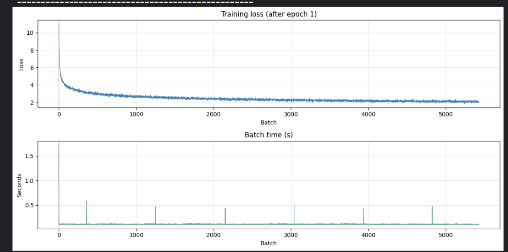
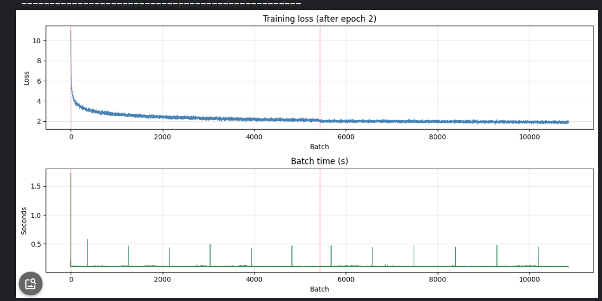
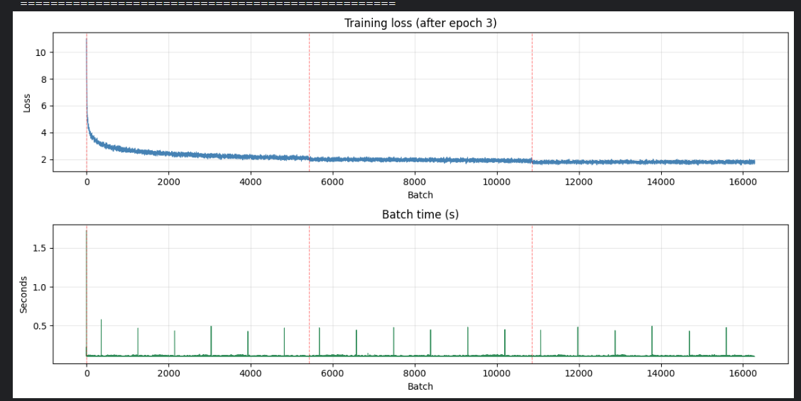
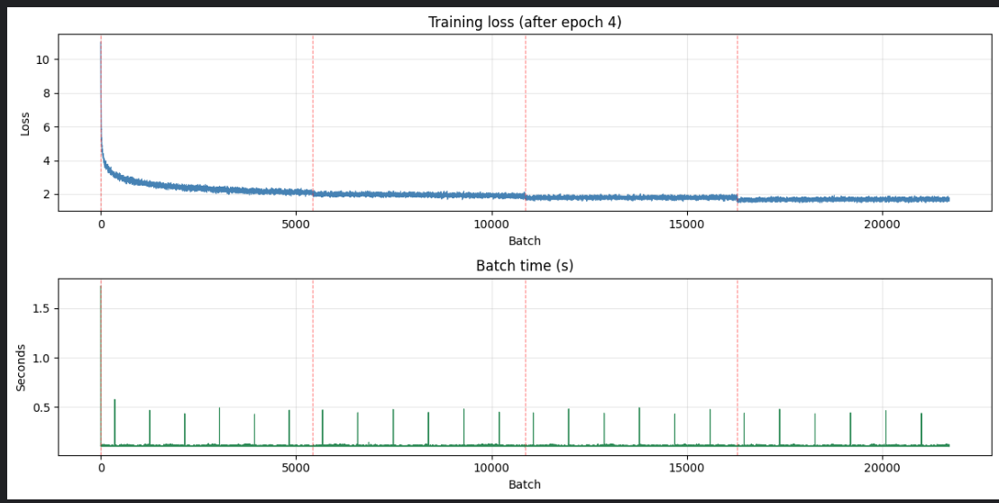

# LLaMA-Style Transformer From Scratch — GQA, KV Cache, RoPE & RMSNorm

A complete implementation of a LLaMA-style transformer architecture built entirely from scratch in PyTorch. Every component — Grouped Query Attention, KV Cache, Rotary Positional Encoding, and RMSNorm — is implemented manually without relying on any high-level libraries or pretrained weights. The model is trained on the TinyStories dataset and achieves a final average loss of **1.67** after 4 epochs.

---

## Why These Components Matter

### Grouped Query Attention (GQA)
Standard Multi-Head Attention creates one Key and Value head per Query head. With 12 heads this means storing 12 sets of K and V in the cache during inference — expensive in memory. GQA reduces this by sharing one K/V head across a group of Query heads. With `n_heads=12` and `n_kv_heads=4`, every 3 query heads share the same K and V, reducing the KV cache size by 3x with minimal quality loss. This is exactly how LLaMA-2 and LLaMA-3 are designed.

### KV Cache
Without a KV cache, generating each new token requires recomputing Keys and Values for every previous token in the sequence — O(n²) complexity. With a KV cache, K and V are computed once per token and stored. Every subsequent step only computes K and V for the new token and reads the rest from the cache — reducing generation to O(n) per step. This makes inference dramatically faster, especially for long sequences.

### Rotary Positional Encoding (RoPE)
Instead of adding a fixed positional vector to embeddings, RoPE rotates the Query and Key vectors by an angle proportional to their position in the sequence. The dot product between a rotated Q at position m and a rotated K at position n naturally encodes their relative distance m-n. This gives the model better length generalization and is used in all modern LLMs including LLaMA, Mistral, and Qwen.

### RMSNorm
A simpler and faster alternative to LayerNorm. Instead of computing mean and variance, it only computes the Root Mean Square of the input and normalizes by it. This removes the mean-centering step, saving computation while still stabilizing training. Used in LLaMA instead of the original transformer's LayerNorm.

---

## Training Results

Trained on a subset of the TinyStories dataset using 2x T4 GPUs on Kaggle with `DataParallel`.

| Epoch | Avg Loss | Time |
|-------|----------|------|
| 1 | 2.4560 | 47m 36.9s |
| 2 | 1.9504 | 47m 37.8s |
| 3 | 1.7884 | 47m 37.6s |
| 4 | 1.6764 | 47m 36.5s |

**Total training time: ~3h 10m**

Loss curve after each epoch showing consistent convergence from a random baseline of ~10.8 down to ~1.67:

### Epoch 1


### Epoch 2


### Epoch 3


### Epoch 4


---

## Model Architecture

```
Llama
├── Embedding          — token embedding [vocab_size → d_model]
├── TransformerBlock × n_layers
│   ├── RMSNorm
│   ├── GroupedQueryAttention
│   │   ├── Wq  [d_model → n_heads * head_dim]
│   │   ├── Wk  [d_model → n_kv_heads * head_dim]
│   │   ├── Wv  [d_model → n_kv_heads * head_dim]
│   │   ├── RoPE applied to Q and K
│   │   ├── KV Cache (prefill + decode)
│   │   └── Wo  [d_model → d_model]
│   ├── RMSNorm
│   └── FeedForward    — [d_model → 4*d_model → d_model] with SiLU
├── RMSNorm
└── Linear             — [d_model → vocab_size]
```

### Default Config

```python
@dataclass
class Config():
    d_model:    int   = 768
    vocab_size: int   = 50257
    n_heads:    int   = 12
    n_kv_heads: int   = 4
    n_layers:   int   = 32
    eps:        float = 1e-5
```

---

## Project Structure

```
├── model.py        — full model definition (Config, Embedding, RMSNorm, RoPE, GQA, FeedForward, TransformerBlock, Llama)
├── generate.py     — generate_inference() function with prefill + KV cache decode loop
├── inference.py    — loads model, initializes cache, runs generation
├── train.py        — training loop, set your DataLoader and hyperparameters here
└── README.md
```

---

## File Descriptions

### `model.py`
Contains all model classes and utility functions:
- `Config` — dataclass holding all hyperparameters
- `Embedding` — standard token embedding layer
- `RMSNorm` — root mean square normalization with learnable scale
- `compute_theta_frequencies` — precomputes RoPE rotation angles
- `apply_rotation` — applies RoPE to Q and K tensors
- `repeat_kv` — expands KV heads to match query heads for GQA
- `GroupedQueryAttention` — full GQA with KV cache support, `init_cache()`, and `use_cache` flag
- `FeedForward` — two-layer MLP with SiLU activation
- `TransformerBlock` — pre-norm residual block combining attention and feedforward
- `Llama` — top-level model stacking all components

### `generate.py`
Contains the `generate_inference()` function implementing the two-phase generation:
1. **Prefill** — processes the full prompt in one forward pass, populates the KV cache
2. **Decode loop** — generates one token at a time, writing only the new token to the cache each step

### `inference.py`
Entry point for running inference. Loads the model, moves it to device, initializes the KV cache across all layers, and calls `generate_inference()`. Edit this file to change your prompt or the number of tokens to generate.

### `train.py`
Training loop. Set up your dataset, DataLoader, optimizer, and number of epochs here. Uses `CrossEntropyLoss` on raw logits. The model's `forward()` is called with `use_cache=False` during training since the full causal mask handles all positions at once.

---

## Getting Started

### Install dependencies

```bash
pip install torch transformers
```

### Run inference

```bash
python inference.py
```

### Run training

Edit `train.py` to point to your dataset, then:

```bash
python train.py
```

---

## Adapting to Your Setup

To use a different dataset, open `train.py` and replace the DataLoader with your own:

```python
from torch.utils.data import DataLoader
from your_dataset import YourDataset

dataset = YourDataset(your_tokens, context_length=128)
train_loader = DataLoader(dataset, batch_size=32, shuffle=True)
```

To change model size, edit `Config` in `model.py`:

```python
config = Config(
    d_model=512,
    n_heads=8,
    n_kv_heads=2,
    n_layers=6
)
```

To extend the maximum generation length, increase `max_seq_len` when initializing the cache:

```python
for layer in model.layers:
    layer.groupedattention.init_cache(max_seq_len=1024, device=device)
```

---

## Requirements

- Python 3.10+
- PyTorch 2.x
- transformers (for GPT-2 tokenizer)
- numpy

---

## Key Implementation Details

- KV cache is preallocated as a fixed-size zero tensor before generation and filled slot by slot during the decode loop
- `repeat_kv` uses `expand` instead of `repeat` so no new memory is allocated when broadcasting KV heads to match Q heads
- RoPE frequencies are computed on CPU and moved to the input tensor's device at runtime, making the code device-agnostic
- Training uses `use_cache=False` with a full causal mask; inference switches to `use_cache=True` with the prefill/decode split
- The model uses pre-normalization (RMSNorm before attention and feedforward) following the LLaMA design rather than post-normalization
